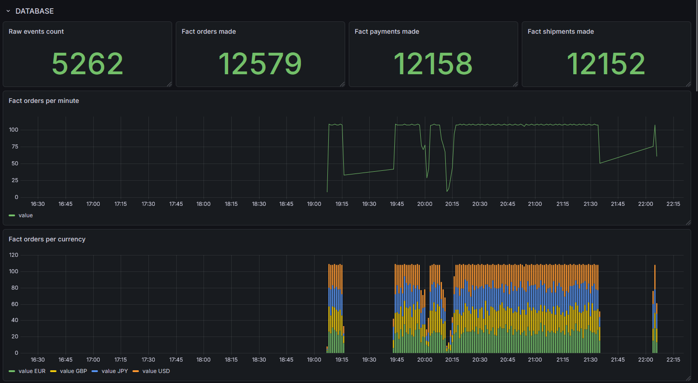
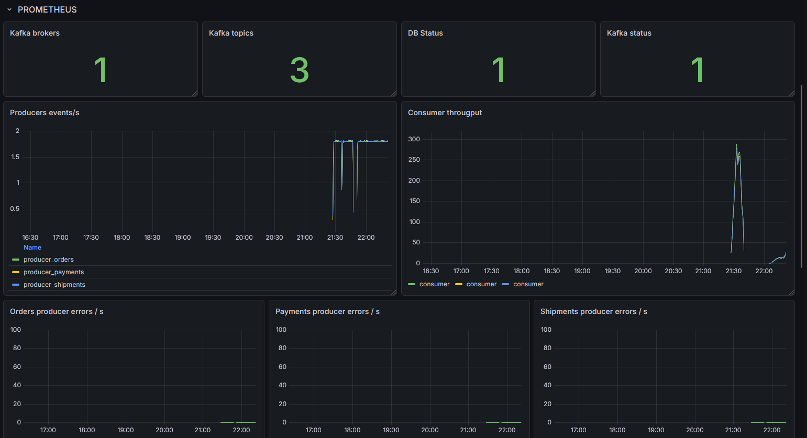
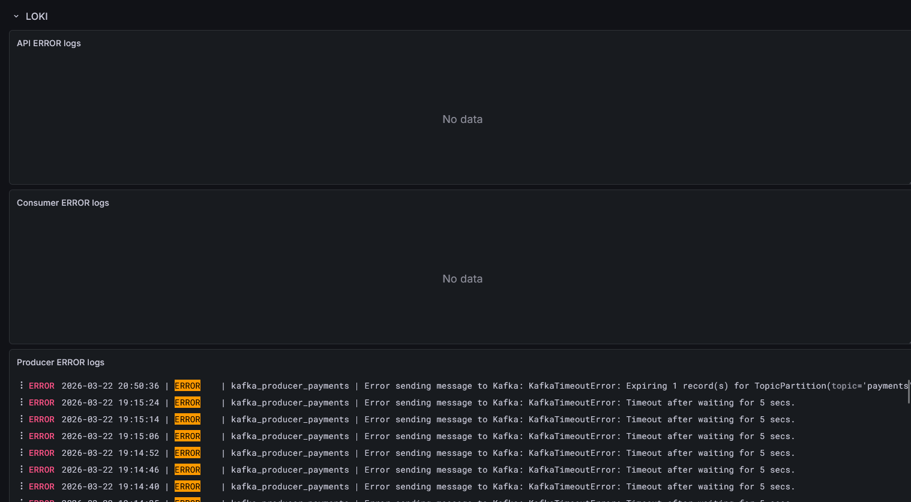

# RTE-cAP

Real-Time Event Capture & Analytics Pipeline.

RTE-cAP is a containerized, event-driven data platform that simulates a small e-commerce flow end to end:
`orders -> payments -> shipments`.

The project covers:
- real-time event production and ingestion with Kafka,
- durable raw storage in PostgreSQL,
- curated analytical models in dbt,
- API health/status checks,
- full observability with Prometheus, Grafana, Loki, and Promtail.

## Table of Contents

- [Architecture](#architecture)
- [Tech Stack](#tech-stack)
- [Repository Structure](#repository-structure)
- [Prerequisites](#prerequisites)
- [Configuration](#configuration)
- [Quick Start](#quick-start)
- [Services and Ports](#services-and-ports)
- [How the Pipeline Works](#how-the-pipeline-works)
- [Data Model](#data-model)
- [API Endpoints](#api-endpoints)
- [Observability](#observability)
- [Useful Commands](#useful-commands)
- [Troubleshooting](#troubleshooting)
- [Roadmap Ideas](#roadmap-ideas)

## Architecture

### Event flow

1. `orders_producer` generates order events and sends them to Kafka topic `orders`.
2. `payments_producer` reads order context from Redis and generates payment events to topic `payments`.
3. `shipments_producer` reads payment context from Redis and generates shipment events to topic `shipments`.
4. `consumer` reads all three topics and persists messages into `raw.raw_events` in PostgreSQL.
5. `dbt` builds staging and mart models in the warehouse schema (`wh`).
6. `api` exposes service health, pipeline status, and Prometheus-compatible metrics.

### Why Redis is used

Redis is used as a lightweight coordination queue between producers, so payments and shipments reference real upstream entities instead of random IDs.

## Tech Stack

- Python 3.12
- Apache Kafka (KRaft mode)
- Redis
- PostgreSQL 15
- dbt (`dbt-core`, `dbt-postgres`)
- FastAPI + Uvicorn
- Prometheus
- Grafana
- Loki + Promtail
- Docker Compose

## Repository Structure

```text
.
|-- api/                        # FastAPI app (health, metrics, pipeline status)
|-- kafka_consumer/             # Kafka -> Postgres raw ingestion
|-- kafka_producer/             # Orders, payments, shipments producers
|-- db/
|   |-- init/                   # SQL bootstrap (schemas, raw tables, seed-like inserts)
|   |-- models.py               # SQLAlchemy raw event model
|   `-- session.py              # SQLAlchemy session/engine
|-- dbt/
|   |-- dbt_project.yml
|   |-- profiles.yml
|   `-- rte_cap/models/
|       |-- staging/            # JSON parsing and typing from raw events
|       `-- marts/              # Fact and dimension models
|-- monitoring/                 # Prometheus, Grafana, Loki, Promtail configs
|-- logs/                       # Shared log volume for central log collection
|-- docker-compose.app.yml      # App/data stack
|-- docker-compose.monitoring.yml # Observability stack
|-- Dockerfile.api
|-- Dockerfile.consumer
|-- Dockerfile.producer
|-- Dockerfile.dbt
|-- .env.example
`-- README.md
```

## Prerequisites

- Docker Desktop (or Docker Engine + Compose v2)
- At least ~6 GB RAM available for containers
- Open ports: `3000`, `5432`, `6379`, `8000`, `9090`, `9092`, `3100`

## Configuration

1. Create your environment file:

```bash
cp .env.example .env
```

2. Default variables (from `.env.example`):

```env
KAFKA_VERSION=4.2.0
KAFKA_HOST=kafka
KAFKA_HOST_PORT=9092
KAFKA_INTERNAL_PORT=19092
KAFKA_CONTROLLER_PORT=9093

POSTGRES_PASSWORD=postgres
POSTGRES_USER=postgres
POSTGRES_DB=orders_db
POSTGRES_PORT=5432
DATABASE_URL=postgresql+psycopg2://postgres:postgres@db:5432/orders_db

GEN_RATE=2
REDIS_URL=redis://redis:6379
```

You can tune event throughput by changing `GEN_RATE`.

## Quick Start

1. Start monitoring stack:

```bash
docker compose -f docker-compose.monitoring.yml up -d
```

2. Start app stack:

```bash
docker compose -f docker-compose.app.yml up -d --build
```

3. Verify API health:

```bash
curl http://localhost:8000/health
```

4. Build dbt models:

```bash
docker compose -f docker-compose.app.yml run --rm dbt dbt build
```

5. Check pipeline status:

```bash
curl http://localhost:8000/pipeline/status
```

## Services and Ports

### Application stack (`docker-compose.app.yml`)

- Kafka broker: `localhost:9092`
- PostgreSQL: `localhost:5432`
- Redis: `localhost:6379`
- API: `localhost:8000`
- Producer metrics:
  - orders: `9103`
  - payments: `9104`
  - shipments: `9105`
- Consumer metrics: `9102`

### Monitoring stack (`docker-compose.monitoring.yml`)

- Prometheus: `http://localhost:9090`
- Grafana: `http://localhost:3000`
- Loki: `http://localhost:3100`

## How the Pipeline Works

### Kafka topics

Topics are initialized automatically by `kafka-init`:
- `orders` (3 partitions)
- `payments` (3 partitions)
- `shipments` (3 partitions)

### Consumer idempotency

Kafka messages are persisted into `raw.raw_events` with a uniqueness constraint on:
`(kafka_topic, kafka_partition, kafka_offset)`.

This makes ingestion safe against duplicate processing.

### dbt transformation layers

- `staging` models parse JSON payloads and cast data types.
- `marts` models expose analytics-ready facts/dimensions in schema `wh`.

## Data Model

### Raw schema (`raw`)

- `raw.raw_events` - append-only event store from Kafka
- `raw.raw_categories`
- `raw.raw_products`
- `raw.raw_customers`

### Warehouse schema (`wh`) via dbt

Dimensions:
- `dim_categories`
- `dim_products`
- `dim_customers`

Facts:
- `fct_orders`
- `fct_payments`
- `fct_shipments`

## API Endpoints

- `GET /health`
  - basic liveness endpoint
- `GET /metrics`
  - Prometheus metrics for API + DB/Kafka health gauges
- `GET /pipeline/status`
  - quick row-count snapshot of raw and fact tables

Examples:

```bash
curl http://localhost:8000/health
curl http://localhost:8000/metrics
curl http://localhost:8000/pipeline/status
```

## Observability

### Prometheus

Scrape targets are configured for:
- API
- all 3 producers
- consumer

Configuration file: `monitoring/prometheus.yml`.

### Grafana

Provisioned automatically with:
- data sources (Prometheus, Loki, PostgreSQL),
- dashboard provider,
- dashboard JSON from repository files.

Configuration files:
- `monitoring/datasources.yml`
- `monitoring/dashboards.yml`
- `monitoring/grafana-dashboard.json`

### Loki + Promtail

Promtail tails logs from `./logs` and ships them to Loki.

Configuration files:
- `monitoring/promtail-config.yml`
- `monitoring/loki-config.yml`





## Useful Commands

Rebuild app stack:

```bash
docker compose -f docker-compose.app.yml up -d --build
```

Stop data generators and consumer:

```bash
docker compose -f docker-compose.app.yml stop consumer orders_producer payments_producer shipments_producer
```

Start them again:

```bash
docker compose -f docker-compose.app.yml up -d consumer orders_producer payments_producer shipments_producer
```

Scale consumers:

```bash
docker compose -f docker-compose.app.yml up -d --scale consumer=3
```

Describe consumer group:

```bash
docker compose -f docker-compose.app.yml exec kafka bash -lc "/opt/kafka/bin/kafka-consumer-groups.sh --bootstrap-server kafka:19092 --group raw-events-writer --describe"
```

Alter topic partitions:

```bash
docker compose -f docker-compose.app.yml exec kafka bash -lc "/opt/kafka/bin/kafka-topics.sh --bootstrap-server kafka:19092 --alter --topic orders --partitions 3"
docker compose -f docker-compose.app.yml exec kafka bash -lc "/opt/kafka/bin/kafka-topics.sh --bootstrap-server kafka:19092 --alter --topic payments --partitions 3"
docker compose -f docker-compose.app.yml exec kafka bash -lc "/opt/kafka/bin/kafka-topics.sh --bootstrap-server kafka:19092 --alter --topic shipments --partitions 3"
```

Run dbt manually:

```bash
docker compose -f docker-compose.app.yml run --rm dbt dbt build
```

## Troubleshooting

- `API /pipeline/status fails with missing wh tables`:
  - Run `dbt build` first.
- `No logs in Grafana Loki panels`:
  - Check `logs/` mount and `promtail` container status.
- `Kafka producers running but no payments/shipments`:
  - Verify Redis is healthy and reachable via `REDIS_URL`.
- `Duplicate ingestion entries`:
  - Duplicates should be ignored by unique constraint in `raw.raw_events`; verify consumer logs/metrics.

## Roadmap Ideas

- Add dbt tests (`unique`, `not_null`, `relationships`).
- Add DLQ/retry strategy for poison messages.
- Add CI checks (lint, tests, dbt build validation).
- Introduce multi-broker Kafka setup.
- Add stream processing stage (Flink/Spark).

---

Author: Marcel Seremak
